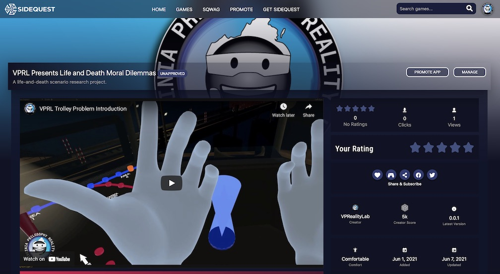

# VPRL Presents Life and Death Dilemmas

Do you ever wonder what you would do in an emergency where you have to decide who lives and who dies?
The VPRL is asking for participants in a research study on moral decision-making in virtual reality settings, and we need your help!  

  

&nbsp;

You can participate in our study by following these 3 easy steps:

&nbsp;

**1. Download and sideload the “VPRL presents Life and Death Moral Dilemmas” app via [Sidequest](https://sidequestvr.com)** 

   -1a. Visit our app listing https://sidequestvr.com/app/4383/vprl-presents-life-and-death-moral-dilemmas and select “Install to Headset” while your headset is plugged into your computer.
   
   -1b. If you're new to sideloading, first install Sidequest and set it up by following the instructions [HERE](https://sidequestvr.com/setup-howto).  This will allow you to install our app on your headset. 

&nbsp;

**2. While the app installs, complete our Informed Consent document and demographics survey [HERE](https://odu.co1.qualtrics.com/jfe/form/SV_2oFIIdy6LeNtj25)**
      
    -2a. Make sure to write down your Survey Code at the end! 
     

 
&nbsp;

**3. Put on your Oculus headset, open your app library, and start the experience!  The app will appear under the “Unknown Sources” folder in your app library.** 

   -3a. When prompted in the experience, please enter the Survey Code you received in Step 2. 

&nbsp;

&nbsp;

Prospective participants must be 18+ years of age and have access to an Oculus headset.  Participants will fill out a brief questionnaire before downloading the virtual reality experience that tests responses to virtual life-and-death scenarios.  

Data collected from responses to these scenarios will inform new behavioral and social models of moral decision making.  These contributions can also help improve decision making modelling for diverse applications from self-driving cars to robotics and AI networks.

For any questions or feedback, reach out to us at vprl@odu.edu. We'd love to hear from you!

This research project has been made possible in part by a grant from the National Endowment for the Humanities.
